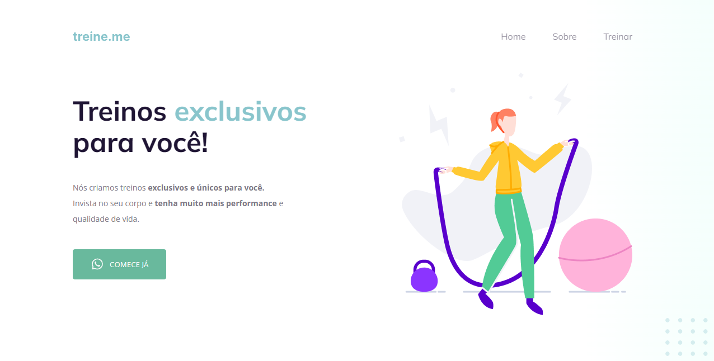
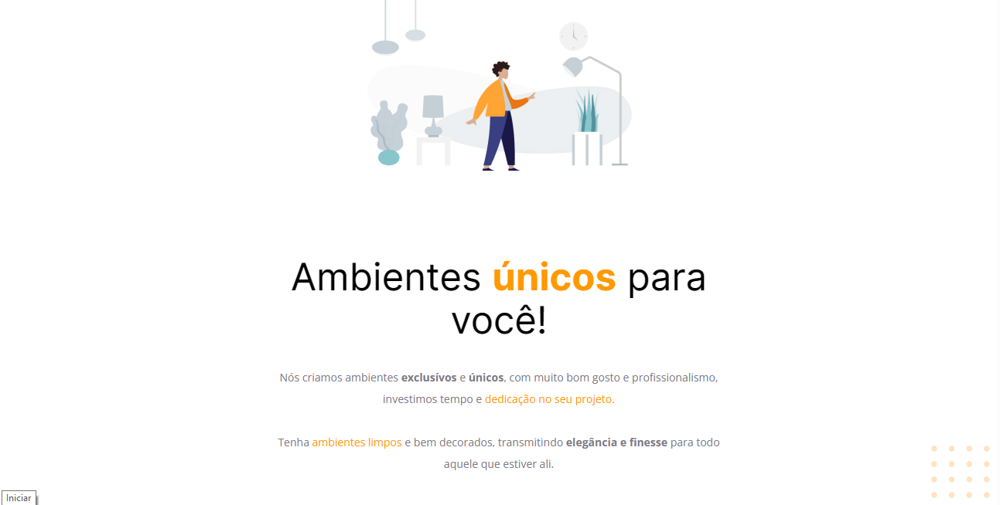
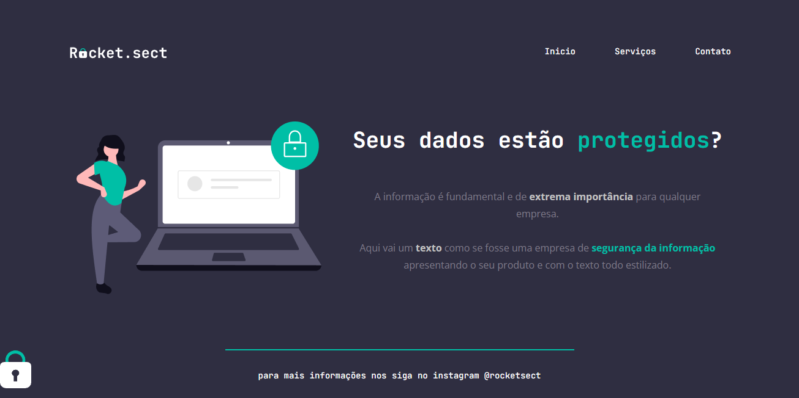
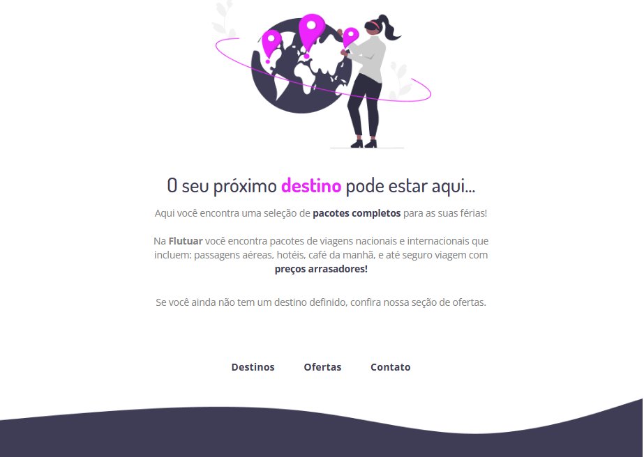

<h1 align="center"> Layout de Pagina </h1>

  <a href="#-tecnologias">Tecnologias</a>
 

 

Academia

  
  

  

Ambiente

  
  

  

Informática

  
  

  

Viagem

  
  

  

## 🚀 Tecnologias

Esse projeto foi desenvolvido com as seguintes tecnologias:

- HTML, CSS
